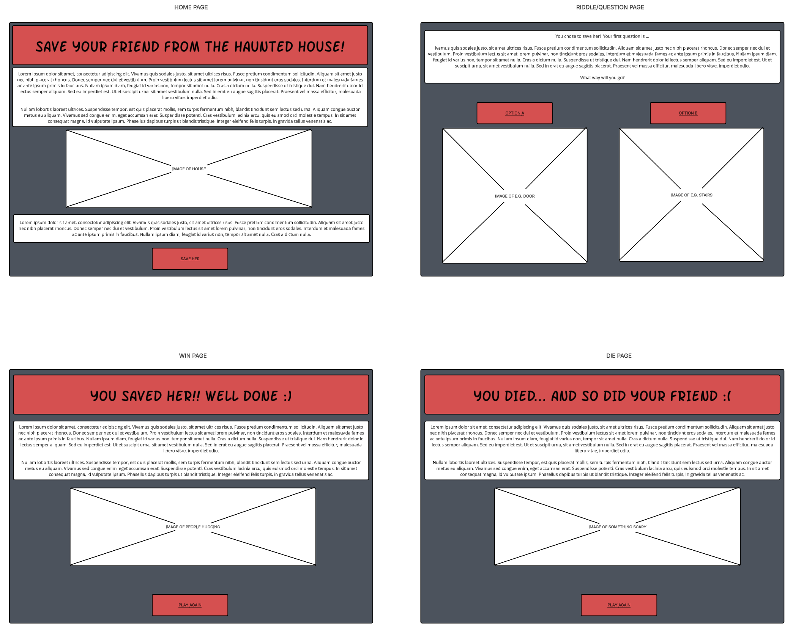
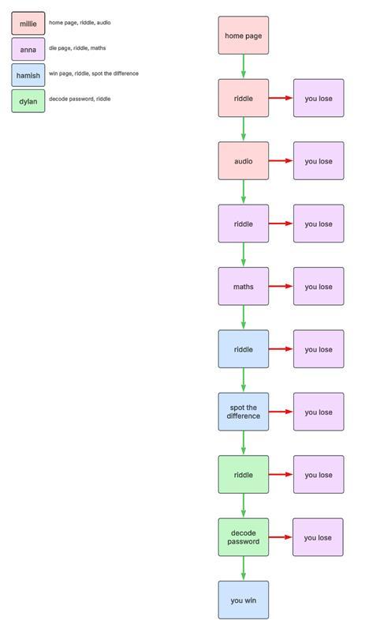
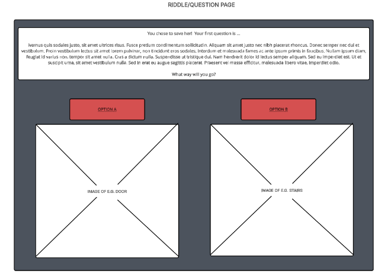
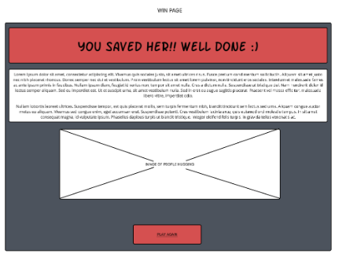

We are planning to make a game website based on a **CYOAG** concept where you can select options for different outcomes including with puzzels. The idea would be we would have a background with buttons on parts of the image that would relate to an item to interact with such as a note on the wall you could click to read a clue, Answer a question or Solve a puzzle. It would be story based on your friend investigated an abandoned building and got trapped inside now you have to go in and navigate your way around and track any clues to your friend but you can tell there is something not quite right with the building or what is inside. You have to then find a key to release your friend and to get out. I vision it will be a background will be the scene you are in and there will be clues around the room you can click on to interact with to solve a puzzle or riddle similar to our webframes.

I had a look at some dungeon websites and CYOAG styled games none really reached what I was thinking of as most are purley text based. Which isnt bad and would be easy but I imgaine ours being a bit more image based and solving puzzles. AI will most likely be used for certian images as we are not doing design nor do i have experince in design I would spend my whole time making something I like rather than writing code. Aswell AI Maybe used for ideas to base some riddle ideas and puzzles on. I dont currently plan on using any APIs some that are on the table possibly is Trivia API `https://the-trivia-api.com/` as this could give us alot of questions but im not sure how many would relate to our topic.

We will have around 11 Pages that "could be displayed" but this will consist of 10 pages which are main gameplay `Home page > Riddle > audio > Riddle > Maths > Spot the difference` the `you win` but if you fail of any of the tasks the you loose image we could possibly design a you loose page for both but this would depend on time limits. I will be responsable for `Win Page`, `Riddle`, `spot the difference` I plan for the `Win Page` a wholesome photo of the characters hugging either after finding each other or after they got out. The riddle will be based on the mansion or the spooky old previous owner who could possibly be the reason why the place is so creepy and is what "Haunts the building" the spot difference I am most concerned about how it will turn out but my plan will be that there will be 2 images either on the wall or table maybe a news paper from the early 1700s and you have to spot where the ghosts are in the photo and not in the other photo. The user after completing a task will see the door being unlocked or something to indicate the door can be entered which then allows them to the next page the strcuture of the website is pretty simple 

We have defined some key features we would like in our website which i think will really define what we are trying to make which is a  CYOAG puzzle escape game. The main features we have discussed is riddles, Sound (For example a door with a noise behind each door and you will have to figure out which is the correct door depending on the sound), Math questions, and spot the diffrence. I will be in charge of spot of the difference aswell as part of the riddles.

I plan to work to work on the project on Tuesdays as this is the day I will be on day release for the GA and when I can during work hours and at home, since i am tasked with Win page, riddle and a spot the difference game I will am planning to work on the riddle first this shouldnt take long maybe day max depends how good of a riddle i can find or if i want to implement the API mentioned above for riddles which could be good as it would change everytime but the problem being it may not relate to the story very much. I would rather it kept inline with the story. spot the difference may take a little longet but I think this may take me a day or 2 to do depending how complicated I want to make it, I will then end on the win page each will not take long at all as it wont involve much to do apart from the image and some buttons like a restart Button to try different outcomes.

## How i think each section will look

### Riddle

I plan the riddle page to look like the above wireframe most likely but I like the idea of being able to click on a object to interact with it for the riddle such as a piece of paper or news paper with a riddle and you have to enter the answer or click on a object that is the answer. such as a clock or a photo or even entering entering the answer in text 

### Spot the difference

Spot the difference is where I think will test me the most but shouldnt be too hard I have an idea of 2 Photos which are quite old and there is around 5 objects you will have to see the difference in which would help you find guide your way to your friend. Maybe like numbers or changes in the different images will give you the clues you need to proceed with the quest I imagine seeing the differences that lead you to the clue could be like a door that is not in one of the photos is the same door you need to enter or mural in a photo and the centre piece of the mural is a mural on the door or answer such as a lion or a shape.

### Win Page

The win page will display the 2 freinds hugging after finding each other. With a button to restart.

Our website will be hosted on [our teams Github pages](https://iwantsome314.github.io/Group46/)  